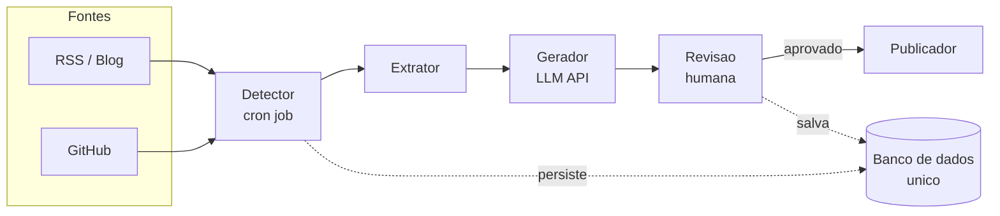
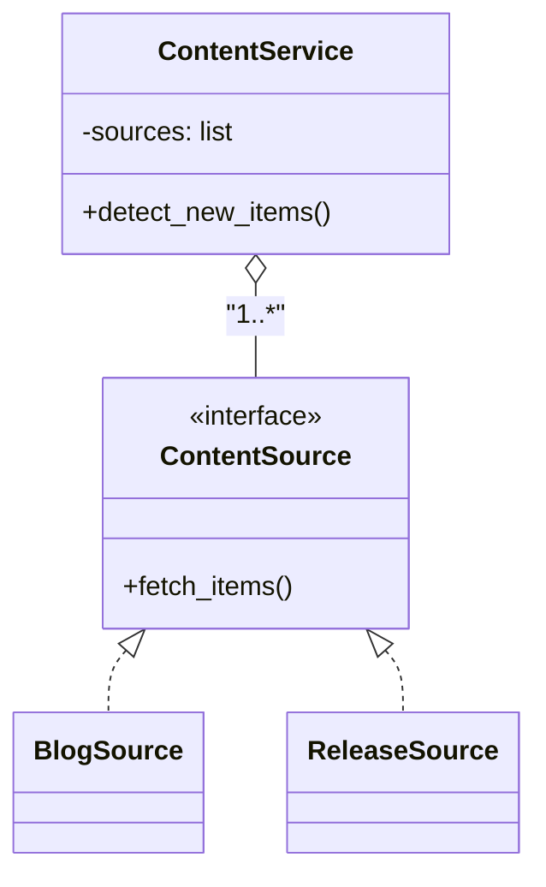
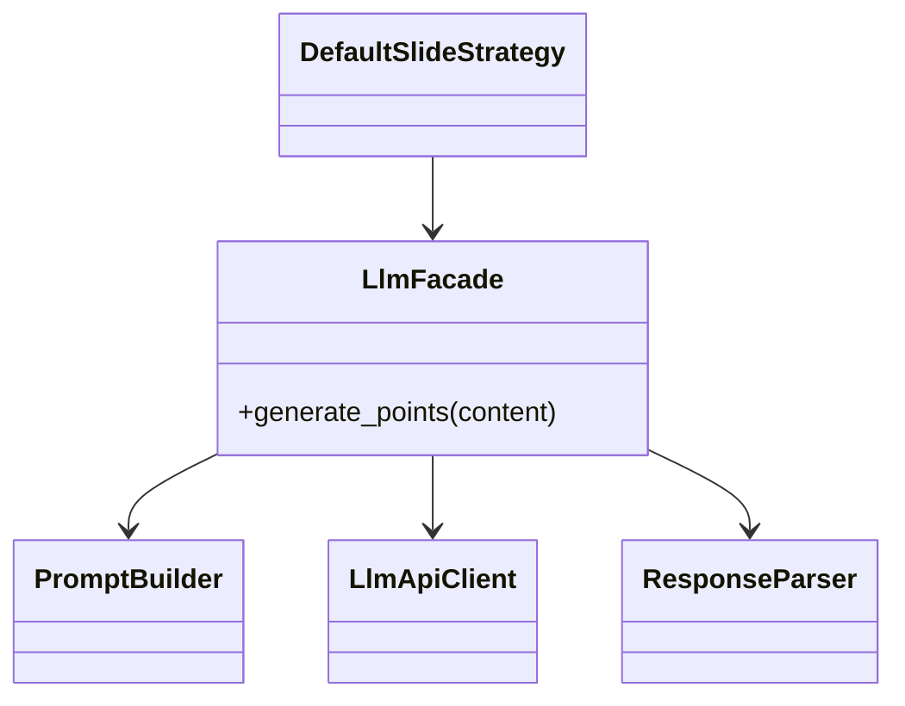

# Atividade Avaliativa Prática — Parte 2

**Disciplina:** Engenharia de Software  
**Aluno(a):** Felipe Dos Santos Rodrigues  
**Data:** 15/05/2026  

---

## Tarefa 2.1 — Definicao da Arquitetura

**Identificacao e justificativa do padrao:** Escolhi a combinacao de Event-Driven Architecture + Pipes and Filters, organizada em camadas. Isso atende ao dominio porque o sistema precisa reagir automaticamente a novos conteudos (historia 1), processar em etapas claras ate gerar o roteiro (historia 2) e interromper o fluxo para revisao humana obrigatoria (historia 3). As camadas isolam integracoes externas e mantem a logica de negocio testavel.

**Representacao dos componentes e relacionamentos:**

**Componentes principais e responsabilidades:**
- Fontes externas: publicam eventos quando surge conteudo novo.
- Detector: identifica novos itens a partir das fontes.
- Extrator: prepara o conteudo base para geracao.
- Gerador: cria o roteiro tecnico-educativo.
- Revisao humana: valida e ajusta o roteiro, marcando trechos sensiveis.
- Publicador: exporta o roteiro aprovado.
- Banco de dados unico: guarda itens detectados e historico.

**Limitacao / trade-off:** Mesmo com simplificacao, a separacao logica em etapas pode gerar mais codigo e overhead de manutencao do que um script linear unico.

Minha reflexao: preferi essa arquitetura porque ela garante reatividade, um fluxo claro com revisao obrigatoria e isolamento das integracoes externas.

---

## Tarefa 2.2 — Implementacao com Padroes de Projeto

O prototipo atende duas historias de prioridade alta: (1) deteccao automatica de novos conteudos e (2) geracao de roteiro com tom tecnico-educativo. O fluxo principal esta em [codigo/app/service.py](codigo/app/service.py#L1-L38).

### Padrao 1 — Strategy (comportamental)

**Onde foi aplicado:** As fontes de conteudo seguem a interface `ContentSource`, com implementacoes concretas como `BlogSource` e `ReleaseSource`. O `ContentService` agrega uma lista de fontes e nao depende de uma fonte especifica.
- [codigo/app/sources.py](codigo/app/sources.py#L1-L26)
- [codigo/app/service.py](codigo/app/service.py#L1-L33)

**Diagrama aplicado ao projeto:**

### Padrao 2 — Facade (estrutural)

**Onde foi aplicado:** `LlmFacade` encapsula prompt, chamada ao LLM e parsing da resposta. `DefaultSlideStrategy` usa apenas o metodo `generate_points`.
- [codigo/app/llm_facade.py](codigo/app/llm_facade.py#L1-L33)
- [codigo/app/generator.py](codigo/app/generator.py#L1-L38)

**Diagrama aplicado ao projeto:**

Revisao critica: Se novas fontes aparecerem em grande quantidade, a Strategy pode exigir muitas classes pequenas e ficar dificil para novos membros do time entenderem qual usar; nesse caso, um registro dinamico de fontes (dicionario tipo -> classe) reduziria o acoplamento no servico. Para o Facade, se o LLM mudar de forma radical, a saida seria extrair `LlmApiClient` como interface e manter implementacoes por provedor, preservando o Facade como ponto estavel.

---

## Tarefa 2.3 — Testes

Foram escritos testes com `unittest` para duas funcoes centrais: `ContentRepository.register_new_items()` e `CarouselGenerator.generate()`. Cada uma cobre cenario de sucesso, falha e borda.

- [codigo/tests/test_repository.py](codigo/tests/test_repository.py#L1-L67)
- [codigo/tests/test_generator.py](codigo/tests/test_generator.py#L1-L57)

**Estrategia de teste:** Usei testes de unidade focados em regras de negocio isoladas (registro de itens e geracao de slides). Essa estrategia e adequada porque o prototipo e deterministico e nao depende de rede ou banco. Nao cobri a integracao com LLM nem o fluxo ponta a ponta do `ContentService`, pois exigem infraestrutura externa e seriam mais apropriados como testes de integracao.

Revisao critica: A parte mais dificil de testar em escala real seria o `LlmFacade`, porque o comportamento depende de respostas de um provedor externo e de parsing textual. Em um sistema maior, a variacao de modelos e formatos exigiria contratos ou mocks mais robustos, e testes poderiam quebrar com mudancas pequenas no prompt ou na resposta.
